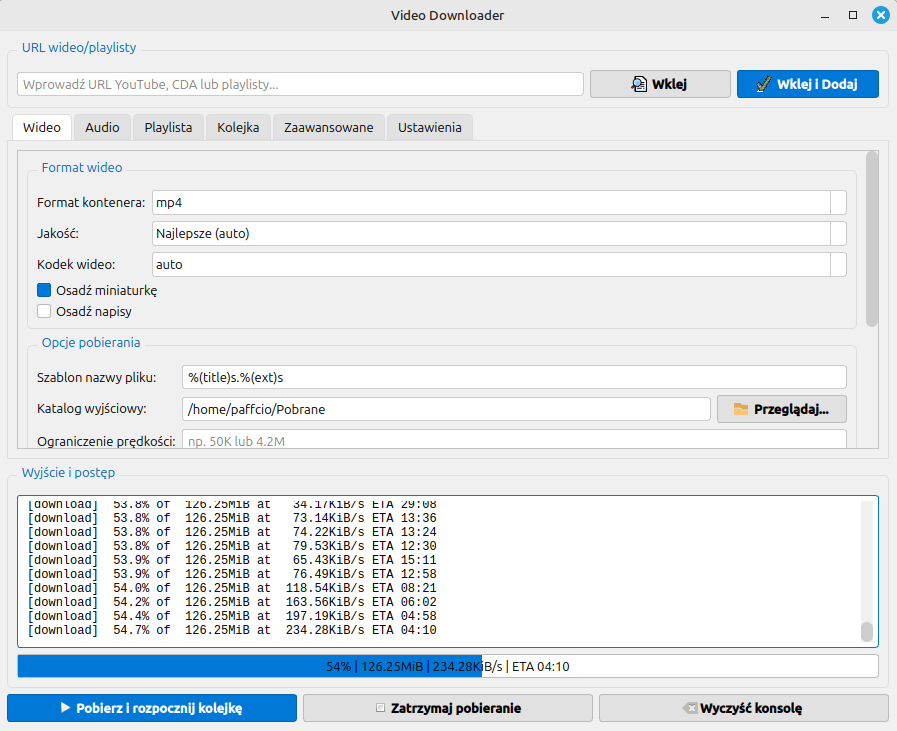
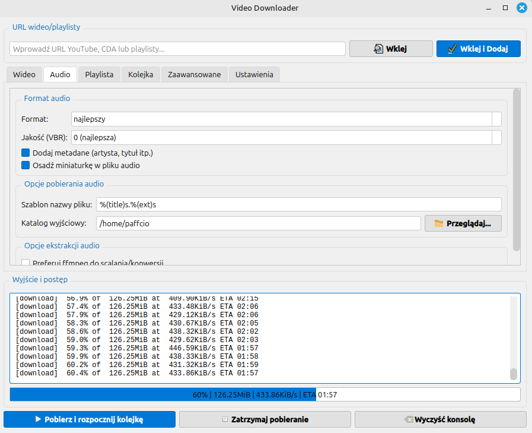
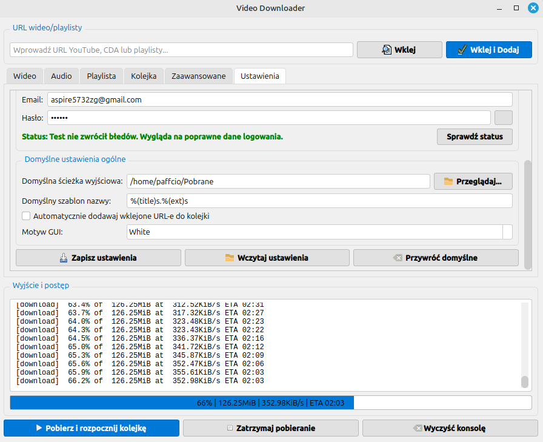
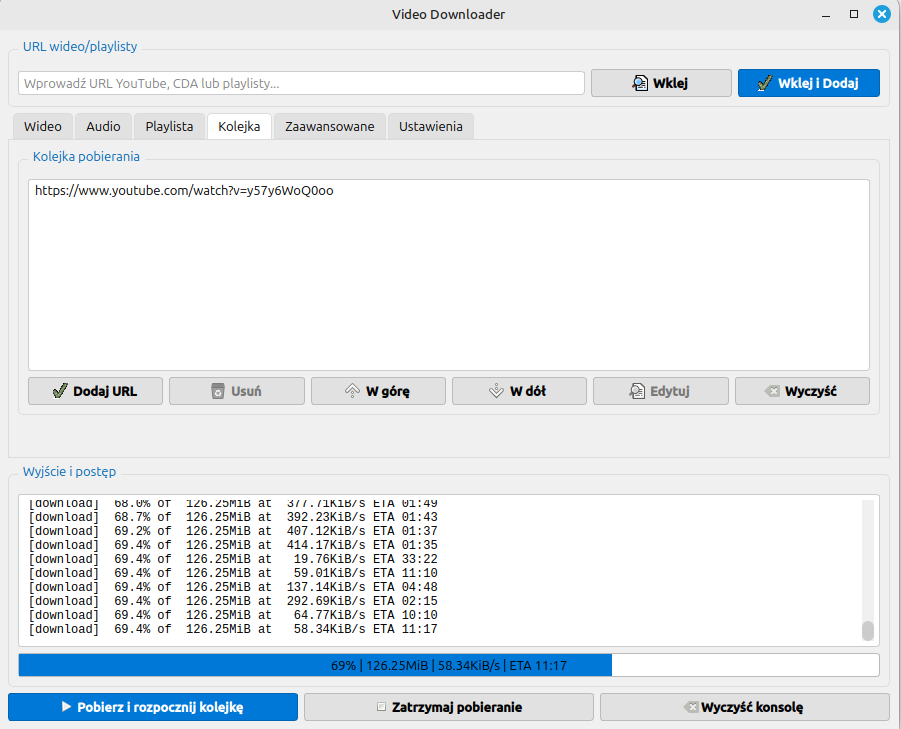

# 🎬 YTDLP-GUI | Supports Polish language only!

<div align="center">


**Nowoczesny graficzny interfejs użytkownika dla yt-dlp**

*Pobieraj filmy i muzykę z YouTube, CDA.pl i setek innych platform w kilku kliknięciach!*

[](https://python.org)
[](https://pypi.org/project/PyQt6/)
[](LICENSE)
[](#instalacja)

</div>

## 📋 Spis treści

- [🌟 Funkcje](#-funkcje)
- [📸 Zrzuty ekranu](#-zrzuty-ekranu)
- [⚡ Szybki start](#-szybki-start)
- [🛠️ Instalacja](#-instalacja)
  - [Windows](#windows)
  - [Linux](#linux)
- [💡 Użytkowanie](#-użytkowanie)
- [🔧 Konfiguracja](#-konfiguracja)
- [🤝 Wsparcie](#-wsparcie)
- [📄 Licencja](#-licencja)

## 🌟 Funkcje

### 🎯 Główne możliwości
- **📹 Pobieranie wideo** - Obsługa YouTube, Vimeo, Dailymotion i 1000+ innych platform
- **🎵 Ekstraktowanie audio** - Konwersja do MP3, AAC, FLAC, OGG z wyborem jakości
- **📋 Obsługa playlist** - Pobieranie całych playlist z możliwością filtrowania
- **🔒 CDA Premium** - Pełne wsparcie dla kont CDA Premium z weryfikacją statusu (wymagane zalogowanie poprzez email i hasło w ustawieniach programu)
- **⚡ System kolejki** - Dodawanie wielu linków do kolejki i pobieranie wsadowe z obsługą nieudanych pobierań
- **🎨 Motywy wizualne** - Ciemny i jasny motyw interfejsu

### 🛠️ Zaawansowane opcje
- **📱 Wybór jakości** - Od 144p do 4K/8K z automatycznym wyborem najlepszej
- **🎞️ Formaty wideo** - MP4, MKV, WEBM, AVI z różnymi kodekami
- **🎧 Formaty audio** - MP3, AAC, FLAC, OGG, M4A, OPUS
- **📝 Metadane** - Automatyczne dodawanie tytułów, opisów i miniaturek
- **🌐 Napisy** - Pobieranie napisów w wielu językach
- **🔄 Proxy i sieć** - Obsługa proxy, ograniczenie prędkości, wybór IP
- **📦 Auto-pobieranie zależności** - Automatyczne pobieranie yt-dlp i FFmpeg na Windows i Linux

### 🎛️ Interfejs użytkownika
- **🖱️ Intuicyjny interfejs** - Przejrzyste zakładki dla różnych funkcji
- **📊 Monitoring postępu** - Szczegółowe informacje o pobieraniu w czasie rzeczywistym
- **📋 Schowek** - Automatyczne wklejanie linków ze schowka
- **💾 Zapamiętywanie ustawień** - Automatyczne zapisywanie preferencji
- **🔍 Podgląd informacji** - Wyświetlanie szczegółów filmu przed pobraniem

## 📸 Zrzuty ekranu

<details>
<summary>🖼️ Kliknij, aby zobaczyć interfejs</summary>

### Zakładka Wideo
*Główny interfejs do pobierania filmów z opcjami jakości i formatów*



### Zakładka Audio
*Ekstraktowanie dźwięku z filmów z wyborem jakości i formatów*



### Zakładka Ustawienia
*Konfiguracja ścieżek, kont CDA Premium i opcji zaawansowanych*



### Zakładka Kolejka
*Zarządzanie kolejką pobierania z możliwością wsadowego przetwarzania*



</details>

## ⚡ Szybki start

1. **Pobierz i uruchom** aplikację zgodnie z instrukcjami dla Twojego systemu
2. **Wklej link** do filmu YouTube/CDA w pole URL
3. **Wybierz format** (wideo/audio) i jakość
4. **Kliknij "Pobierz"** i ciesz się rezultatem!

## 🛠️ Instalacja

### Windows

#### Metoda 1: Gotowy plik wykonywalny (Zalecane)
```batch
# Pobierz najnowszą wersję z GitHub Releases
# Uruchom YTDLP-GUI.exe
```

#### Metoda 2: Budowanie ze źródeł
```batch
# 1. Sklonuj repozytorium
git clone https://github.com/twoje-repo/YTDLP-GUI.git
cd YTDLP-GUI

# 2. Zainstaluj wymagane biblioteki
pip install -r requirements.txt

# 3. Zbuduj aplikację
build.bat

# 4. Uruchom z folderu dist
dist\YTDLP-GUI.exe
```

### Linux

#### Metoda 1: AppImage (Zalecane dla większości dystrybucji)
```bash
# 1. Sklonuj repozytorium
git clone https://github.com/twoje-repo/YTDLP-GUI.git
cd YTDLP-GUI

# 2. Uruchom skrypt budowania (automatycznie tworzy środowisko wirtualne)
chmod +x build.sh
./build.sh

# Alternatywnie: wybierz typ pakietu podczas budowania
./build.sh appimage  # Tworzy plik AppImage
./build.sh deb       # Tworzy pakiet .deb

# 3. Uruchom AppImage
./YTDLP-GUI-*.AppImage
```

#### Metoda 2: Środowisko wirtualne (Zalecane dla deweloperów)
```bash
# 1. Zainstaluj wymagane pakiety systemowe
sudo apt update
sudo apt install python3 python3-venv python3-full

# 2. Sklonuj repozytorium
git clone https://github.com/twoje-repo/YTDLP-GUI.git
cd YTDLP-GUI

# 3. Utwórz i aktywuj środowisko wirtualne
python3 -m venv venv
source venv/bin/activate

# 4. Zainstaluj zależności i uruchom
pip install -r requirements.txt
python3 yt.py
# yt-dlp i FFmpeg zostaną pobrane automatycznie przy pierwszym uruchomieniu

# 5. Deaktywuj środowisko (po zakończeniu)
deactivate
```

#### Metoda 3: Instalacja systemowa (Ubuntu/Debian/Mint)
```bash
# 1. Zainstaluj wymagane pakiety systemowe
sudo apt update
sudo apt install python3 python3-pip python3-pyqt6 pipx

# 2. Sklonuj i uruchom przez pipx (zalecane)
git clone https://github.com/twoje-repo/YTDLP-GUI.git
cd YTDLP-GUI
pipx install -e .
# lub bezpośrednio:
python3 yt.py
# yt-dlp i FFmpeg zostaną pobrane automatycznie przy pierwszym uruchomieniu
```

#### Metoda 4: Pakiet .deb (Ubuntu/Debian/Mint)
```bash
# 1. Zainstaluj wymagane pakiety systemowe
sudo apt update
sudo apt install python3-venv python3-full python3-pip libxcb-cursor0 libxcb-cursor-dev qt6-base-dev dpkg-dev

# 2. Sklonuj repozytorium
git clone https://github.com/twoje-repo/YTDLP-GUI.git
cd YTDLP-GUI

# 3. Zbuduj pakiet .deb
chmod +x build_deb.sh
./build_deb.sh

# 4. Zainstaluj pakiet
sudo dpkg -i ytdlp-gui_1.0.1_amd64.deb
# W przypadku problemów z zależnościami:
sudo apt-get install -f

# 5. Uruchom aplikację
ytdlp-gui
# lub z menu aplikacji: Menu → Multimedia → YTDLP-GUI

# Odinstalowanie pakietu:
sudo apt remove ytdlp-gui
```

#### Metoda 5: Arch Linux/Manjaro
```bash
# 1. Zainstaluj wymagane pakiety
sudo pacman -S python python-pip python-pyqt6

# 2. Sklonuj i uruchom w środowisku wirtualnym
git clone https://github.com/twoje-repo/YTDLP-GUI.git
cd YTDLP-GUI
python -m venv venv
source venv/bin/activate
pip install -r requirements.txt
python yt.py
# yt-dlp i FFmpeg zostaną pobrane automatycznie przy pierwszym uruchomieniu
```

### 📋 Wymagania systemowe

#### Windows
- **System:** Windows 10/11 (64-bit)
- **Python:** 3.8+ (opcjonalnie, jeśli budujesz ze źródeł)
- **Przestrzeń:** ~200 MB
- **Zależności:** yt-dlp i FFmpeg pobierane automatycznie przy pierwszym uruchomieniu

#### Linux
- **System:** Ubuntu 20.04+, Debian 11+, Linux Mint 20+, Arch Linux
- **Python:** 3.8+
- **Biblioteki:** `python3-pyqt6`, `python3-pip`
- **Przestrzeń:** ~428 MB
- **Zależności:** yt-dlp i FFmpeg pobierane automatycznie przy pierwszym uruchomieniu

## 💡 Użytkowanie

### 🎬 Pobieranie wideo
1. Przejdź do zakładki **"Wideo"**
2. Wklej link w pole **"URL"**
3. Wybierz **format** (MP4, MKV, WEBM) i **jakość**
4. Opcjonalnie ustaw **ścieżkę wyjściową** i **szablon nazwy**
5. Kliknij **"Pobierz"**

### 🎵 Ekstraktowanie audio
1. Przejdź do zakładki **"Audio"**
2. Wklej link w pole **"URL"**
3. Wybierz **format audio** (MP3, AAC, FLAC) i **jakość**
4. Zaznacz opcje **metadanych** i **miniaturek**
5. Kliknij **"Pobierz"**

### 📋 Praca z playlistami
1. Przejdź do zakładki **"Playlista"**
2. Wklej link do playlisty
3. Ustaw **zakres elementów** (np. 1-10, 5,7,9)
4. Wybierz opcje **losowania** lub **odwracania kolejności**
5. Kliknij **"Pobierz"**

### 🔒 Konfiguracja CDA Premium
1. Przejdź do zakładki **"Ustawienia"**
2. W sekcji **"CDA Premium"** wprowadź:
   - **Email** Twojego konta CDA
   - **Hasło** do konta
3. Kliknij **"Sprawdź status"** aby zweryfikować dane
4. Zapisz ustawienia

### ⚡ System kolejki
1. Przejdź do zakładki **"Kolejka"**
2. Dodaj linki przez:
   - **"Wklej i dodaj"** - automatyczne dodanie ze schowka
   - **"Dodaj URL"** - ręczne wprowadzenie
3. Zarządzaj kolejką:
   - **Przenoszenie:** Przeciągnij elementy aby zmienić kolejność
   - **Usuwanie:** Zaznacz i usuń niepotrzebne elementy
   - **Duplikaty:** Automatyczne wykrywanie i opcje obsługi
4. Obsługa nieudanych pobierań:
   - **Oznaczenie:** Nieudane pobierania są oznaczone kolorem
   - **Ponowienie:** Opcja ponowienia nieudanych pobierań
   - **Wznowienie:** Przywracanie kolejki po restarcie aplikacji
5. Skonfiguruj ustawienia dla kolejki i kliknij **"Rozpocznij kolejkę"**

## 🔧 Konfiguracja

### 🛠️ Ustawienia zaawansowane

#### Ścieżki aplikacji
- **yt-dlp:** Ścieżka do wykonywalnego pliku yt-dlp (auto-pobieranie dostępne)
- **FFmpeg:** Ścieżka do FFmpeg (auto-pobieranie dostępne)
- **Katalog wyjściowy:** Domyślny folder dla pobranych plików

#### Opcje sieciowe
- **Proxy:** Konfiguracja serwera proxy (http://proxy:port)
- **Ograniczenie prędkości:** Maksymalna prędkość pobierania
- **Ponowne próby:** Liczba prób w przypadku błędu
- **Force IPv4/IPv6:** Wymuszenie konkretnej wersji protokołu IP

#### Szablony nazw plików
```
%(title)s.%(ext)s                    # Tytuł.rozszerzenie
%(uploader)s - %(title)s.%(ext)s     # Autor - Tytuł.rozszerzenie
%(upload_date)s %(title)s.%(ext)s    # Data Tytuł.rozszerzenie
```

### 🎨 Personalizacja
- **Motyw:** Jasny / Ciemny
- **Automatyczne dodawanie do kolejki:** Włącz/wyłącz
- **Sprawdzanie aktualizacji:** Automatyczne aktualizacje yt-dlp
- **Auto-pobieranie zależności:** Automatyczne pobieranie yt-dlp i FFmpeg

### 🔄 Zarządzanie zależnościami
Aplikacja automatycznie zarządza wymaganymi narzędziami:

#### yt-dlp
- **Windows:** Pobieranie do `lib/yt-dlp.exe`
- **Linux:** Pobieranie do `lib/yt-dlp`
- **Aktualizacje:** Automatyczne sprawdzanie i pobieranie najnowszej wersji
- **Ręczna aktualizacja:** Przycisk "Aktualizuj yt-dlp" w ustawieniach

#### FFmpeg
- **Windows:** Pobieranie pełnej paczki do `lib/ffmpeg/`
- **Linux:** Pobieranie do `lib/ffmpeg/`
- **Ręczne pobieranie:** Przycisk "Pobierz FFmpeg" w ustawieniach
- **Wykrywanie:** Sprawdzanie systemowej instalacji FFmpeg jako alternatywa

## 🤝 Wsparcie

### 🐛 Zgłaszanie błędów
Jeśli napotkasz problem:
1. Sprawdź **logi aplikacji** w folderze `VideoDownloader/logs/`
2. Zgłoś błąd na [GitHub Issues](https://github.com/twoje-repo/YTDLP-GUI/issues)
3. Dołącz informacje o systemie i kroki do reprodukcji

### 💬 Pomoc i wsparcie
- **GitHub Discussions:** Pytania i dyskusje
- **Email:** paffciostudio@gmail.com

### 🔧 Problemy i rozwiązania

#### "Nie można znaleźć yt-dlp"
```bash
# Aplikacja pobierze automatycznie przy pierwszym uruchomieniu
# Jeśli chcesz zainstalować ręcznie:

# Linux: 
pip3 install yt-dlp
# lub
sudo apt install yt-dlp

# Windows: Aplikacja pobierze automatycznie do folderu lib/
```

#### "Błąd FFmpeg"
```bash
# Aplikacja pobierze automatycznie przy pierwszym uruchomieniu
# Jeśli chcesz zainstalować ręcznie:

# Linux: 
sudo apt install ffmpeg

# Windows: Aplikacja pobierze automatycznie do folderu lib/ffmpeg/
# Możesz także włączyć auto-pobieranie w ustawieniach
```

#### Problemy z CDA Premium
- Sprawdź poprawność danych logowania
- Upewnij się, że konto jest aktywne
- Użyj przycisku "Sprawdź status"

#### "externally-managed-environment" (Ubuntu 23.04+, Debian 12+)
```bash
# Błąd przy pip install - użyj środowiska wirtualnego:
python3 -m venv venv
source venv/bin/activate
pip install -r requirements.txt

# Lub użyj pipx:
sudo apt install pipx
pipx install pyinstaller
```

#### Brak uprawnień do build.sh
```bash
# Nadaj uprawnienia wykonywania:
chmod +x build.sh
./build.sh

# Dla skryptu budowania .deb:
chmod +x build_deb.sh
./build_deb.sh
```

#### Problemy z pakietem .deb
```bash
# Brak zależności po instalacji .deb:
sudo apt-get install -f

# Reinstalacja pakietu:
sudo dpkg -r ytdlp-gui
sudo dpkg -i ytdlp-gui_1.0.1_amd64.deb

# Sprawdzenie poprawności pakietu:
dpkg -l | grep ytdlp-gui
dpkg -s ytdlp-gui
```

## 📄 Licencja

Ten projekt jest udostępniony na licencji MIT. Zobacz plik [LICENSE](LICENSE) dla szczegółów.

---

<div align="center">

**🌟 Jeśli YTDLP-GUI jest przydatne, zostaw gwiazdkę na GitHub! 🌟**

Made with ❤️ by [Paffcio](https://github.com/paffciostudio)

[⬆️ Powrót na górę](#-ytdlp-gui)

</div>
